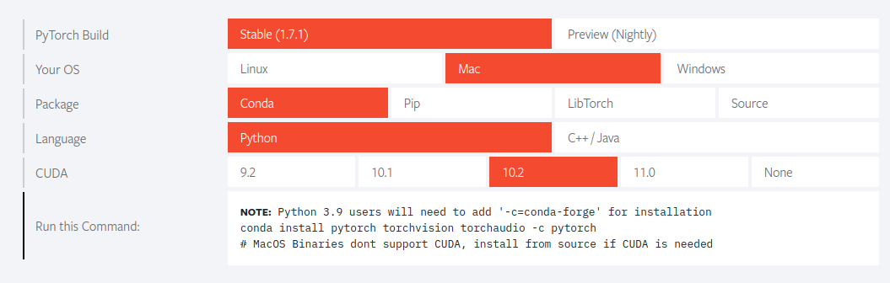
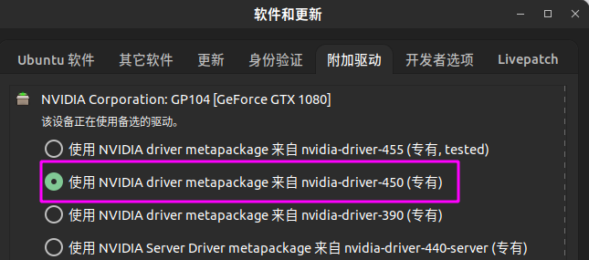

网上大部分的教程都是按照``driver->cuda->cudnn->pytorch``这一顺序进行环境配置的。

这篇文章从最终目标出发，从pytorch逆向分析环境依赖。

<!-- more -->

# 环境说明

ubuntu18.04 + nvidia 1080显卡，显卡驱动在**软件和更新**里面通过附件驱动安装。

# 分析流程

配置环境主要是每个环境的依赖要搞明白，一般是向下兼容的，下面说一下自己的思路。

1. 打开[pytorch官网](https://pytorch.org/)，选择一个自己想要的版本

   

   我这里选择了倒数第二个支持GPU的版本，这里告诉我们**需要CUDA10.2**。

2. 安装cuda

   - 打开[cuda官网](https://developer.nvidia.com/zh-cn/cuda-downloads)，找到自己需要的10.2版本。

   - 选择runfile离线安装（不选择deb离线安装是因为deb安装会产生一堆文件在/var路径下，本洁癖还不知敢不敢删除）

   - 观察下载文件的名字，以10.2的cuda为例子

     

     标出来的就是10.2版本的CUDA最低需要的驱动版本号，也就是**440.33**。

  3. 安装cudnn

     cudnn的[官网](https://developer.nvidia.com/rdp/cudnn-download)的下载界面标出来cuda和cudnn的对应关系，选择和cuda10.2对应的cudnn8.0.5下载，这里依旧不选择deb安装，下载tar压缩包，根据[官方文档](https://docs.nvidia.com/deeplearning/cudnn/install-guide/index.html#installlinux-tar)安装。

4. 安装显卡驱动

   打开软件和更新里面的附加硬件，选择一个版本号**大于**440.33的metapackage安装

   

# 安装

最后安装的时候还是要按照``driver->cuda->cudnn->pytorch``的顺序进行~需要注意的是，安装cuda的时候把driver选项关闭，因为我们通过``软件和更新里面的附加硬件``安装了满足当前cuda依赖的驱动。

# BUG修复

在使用tar压缩包，且按照官网的教程安装cudnn之后，当遇到运行库的链接操作时，会出现下面的错误：

> /sbin/ldconfig.real: /usr/local/cuda-10.2/targets/x86_64-linux/lib/libcudnn_ops_train.so.8 is not a symbolic link
>
> /sbin/ldconfig.real: /usr/local/cuda-10.2/targets/x86_64-linux/lib/libcudnn.so.8 is not a symbolic link
>
> ...

原因是安装cudnn的cp命令，没有把软连接复制过去，而是把源文件复制了一份。
在``/usr/local/cuda-10.2/targets/x86_64-linux/lib/``路径下通过``ls -l``显示软连接的真是路径可以找到原始指向文件，发现没有报错的库文件链接的顺序是``libxxx.so->libxxx.so.8->libxxx.8.0.5``，所以按照下面顺序恢复链接顺序。(报错的文件共7个)

```bash
#1
sudo ln -sf libcudnn_adv_infer.so.8.0.5 libcudnn_adv_infer.so.8

sudo ln -sf libcudnn_adv_infer.so.8 libcudnn_adv_infer.so

#2
sudo ln -sf libcudnn_adv_train.so.8.0.5 libcudnn_adv_train.so.8

sudo ln -sf libcudnn_adv_train.so.8 libcudnn_adv_train.so

#3
sudo ln -sf libcudnn_cnn_infer.so.8.0.5 libcudnn_cnn_infer.so.8

sudo ln -sf libcudnn_cnn_infer.so.8 libcudnn_cnn_infer.so

#4
sudo ln -sf libcudnn_cnn_train.so.8.0.5 libcudnn_cnn_train.so.8

sudo ln -sf libcudnn_cnn_train.so.8 libcudnn_cnn_train.so

#5
sudo ln -sf libcudnn_ops_infer.so.8.0.5 libcudnn_ops_infer.so.8

sudo ln -sf libcudnn_ops_infer.so.8 libcudnn_ops_infer.so

#6
sudo ln -sf libcudnn_ops_train.so.8.0.5 libcudnn_ops_train.so.8

sudo ln -sf libcudnn_ops_train.so.8 libcudnn_ops_train.so

#7
sudo ln -sf libcudnn.so.8.0.5 libcudnn.so.8

sudo ln -sf libcudnn.so.8 libcudnn.so
```

