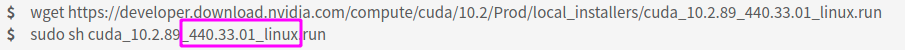

> 网上大部分的教程都是按照``driver->cuda->cudnn->pytorch``这个顺序安装的。这篇文章从pytorch开始，逆着分析怎么解决环境依赖。

<!-- more -->

# 环境说明

ubuntu18.04 + nvidia 1080显卡，显卡驱动在**软件和更新**里面通过附件驱动安装。

# 分析流程

配置环境主要是每个环境的依赖要搞明白，一般是向下兼容的，下面说一下自己的思路。

1. 打开[pytorch官网](https://pytorch.org/)，选择一个自己想要的版本

   

   我这里选择了倒数第二个支持GPU的版本，这里告诉我们**需要CUDA10.2**。

2. 安装cuda

   - 打开[cuda官网](https://developer.nvidia.com/zh-cn/cuda-downloads)，找到自己需要的10.2版本。

   - 选择runfile离线安装（不选择deb离线安装是因为deb安装会产生一堆文件在/var路径下，本洁癖还不知敢不敢删除）

   - 观察下载文件的名字，以10.2的cuda为例子

     

     标出来的就是10.2版本的CUDA最低需要的驱动版本号，也就是**440.33**。

  3. 安装cudnn

     cudnn的[官网](https://developer.nvidia.com/rdp/cudnn-download)的下载界面标出来cuda和cudnn的对应关系，选择和cuda10.2对应的cudnn8.0.5下载，这里依旧不选择deb安装，下载tar压缩包，根据[官方文档](https://docs.nvidia.com/deeplearning/cudnn/install-guide/index.html#installlinux-tar)安装。

4. 安装显卡驱动

   打开软件和更新里面的附加硬件，选择一个版本号**大于**440.33的metapackage安装

   

# 安装

最后安装的时候还是要按照``driver->cuda->cudnn->pytorch``的顺序进行~需要注意的是，安装cuda的时候把driver选项关闭，因为我们通过``软件和更新里面的附加硬件``安装了满足当前cuda依赖的驱动。