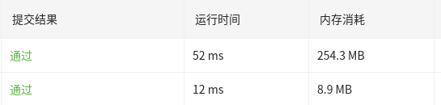

## 题目

## 思路

两种解法：

递归法和栈两种解法。递归法的时间复杂度和空间复杂度都更差，从图1可以看出来。

<!-- more -->

1. 递归法
   
2. 栈
   利用栈的结构特性，遍历一遍



## Show me code
```C++
#include <iostream>
#include <vector>
#include <stack>

using namespace std;

struct ListNode {
    int val;
    ListNode* next;
};

ListNode* newListNode(int value) {
    ListNode* pNode = new ListNode();
    pNode->next = nullptr;
    pNode->val = value;
}

void addToTail(ListNode* node, ListNode* nextNode) {
    if (node==nullptr)
        return;
    node->next = nextNode;
}

void printList(ListNode* pNode){
    while (pNode!=nullptr){
        cout << pNode->val << " ";
        pNode = pNode->next;
    }
    cout << endl;
}

// 方法1：使用栈先入后出的特性，实现反向打印
vector<int> reversePrint(ListNode* head) {
    stack<int> stk;
    vector<int> vec;
    //入栈
    while (head!=nullptr){
        stk.push(head->val);
        head = head->next;
    }
    //出栈
    while(!stk.empty()){
        vec.push_back(stk.top());//栈顶元素进数组
        stk.pop();//出栈
    }
    return vec;
}

//方法2：递归的方法，递归本质就是一个栈结构，但是其时间空间复杂度较差
vector<int> vec_recursive;
vector<int> reversePrint(ListNode* head) {
    if (head == nullptr)
        return vec_recursive;
    reversePrint(head->next);
    vec_recursive.push_back(head->val);
    return vec_recursive;
}

int main(int argc, char** argv) {
    //输入[1,3,2]
    ListNode* node1 = newListNode(1);
    ListNode* node2 = newListNode(3);
    ListNode* node3 = newListNode(2);
    addToTail(node1, node2);
    addToTail(node2, node3);

    cout << "before: ";
    printList(node1);

    // cout << "after: ";
    // vector<int> revList = reversePrint(node1);
    // vector<int>::iterator iter;
    // for (iter = revList.begin(); iter != revList.end();iter++){
    //     cout << *iter << " " ;
    // }
    // cout << endl;

    cout << "after(recursive): ";
    vector<int> revList = reversePrint(node1);
    vector<int>::iterator iter;
    for (iter = revList.begin(); iter != revList.end();iter++){
        cout << *iter << " " ;
    }
    cout << endl;
}
```